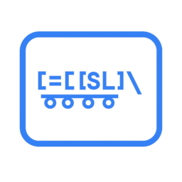

# slq - Storstockholms Lokaltrafik Query

A CLI tool for querying [Storstockholms Lokaltrafik (SL)](https://sl.se) information.

A C implementation using libcurl and jansson for maximum compatibility and minimal footprint.




## Installation

### Prerequisites

Install the required libraries:

**macOS:**
```bash
brew install jansson curl
```

**Ubuntu/Debian:**
```bash
sudo apt-get install libjansson-dev libcurl4-openssl-dev
```

### Build and Install

**System-wide Installation:**
```bash
make
sudo make install
```

**User Installation:**
```bash
make
make install-user
```

### Manual Build

```bash
make
# Binary will be at bin/slq
```

### Development Build

```bash
# Build with debug symbols
make debug

# Run tests  
make test
```

### Uninstallation

```bash
# Remove system-wide installation
sudo make uninstall

# Remove user installation
make uninstall-user
```

## Usage

### Search for stations

Find station names and IDs (output is tab-delimited for easy shell scripting):

```bash
slq search "Central"
```

Output:
```
Centralen	1002
T-Centralen	9001
Stockholms central	9000
...
```

### Check departures

Show upcoming departures from a station with real-time information:

```bash
slq departures "T-Centralen"
# or by station ID:
slq departures "9001"
```

**Output format:**
```
Departures from T-Centralen:
Wait  Time   Line   Destination          Type
----------------------------------------------------------------------
Now   13:35  13     Ropsten              Tunnelbanans röda linje
1m    13:36  19     Odenplan             Tunnelbanans gröna linje
2m    13:37  14     Fruängen             Tunnelbanans röda linje
```

**Filtering options:**

```bash
# Filter by line number (includes variants):
slq departures "T-Centralen" --line 14
slq departures "Station" --line 28    # Shows both 28 and 28s
slq departures "Station" --line 28s   # Shows only 28s

# Filter by transport type:
slq departures "T-Centralen" --transport-type metro    # Tunnelbanan (subway)
slq departures "Odenplan" --transport-type bus         # Buses (Blåbuss, Närtrafiken)
slq departures "Odenplan" --transport-type train       # Trains (Pendeltåg, Roslagsbanan)
slq departures "T-Centralen" --transport-type tram     # Trams (Spårväg City)

# Filter by destination:
slq departures "T-Centralen" --destination "Akalla"    # Only departures going to Akalla
slq departures "T-Centralen" --destination "9001"      # Filter by destination ID
slq departures "Odenplan" --destination "Airport"      # Partial name matching

# Control number of departures shown:
slq departures "T-Centralen" --count 20               # Show 20 departures instead of default 10
slq departures "T-Centralen" --count 5                # Show only 5 departures

# Combine filters:
slq departures "T-Centralen" --line 14 --transport-type metro --destination "Fruängen" --count 15
```

## Examples

```bash
# Find all stations matching "gamla"
slq search "gamla"

# Check what's departing from Gamla Stan
slq departures "Gamla stan"

# Filter departures by line or transport type
slq departures "T-Centralen" --transport-type metro    # Subway lines only
slq departures "Odenplan" --transport-type train       # Train lines only
slq departures "T-Centralen" --line 14                 # Metro line 14
slq departures "Station" --line 28                     # Includes variants like 28s

# Filter by destination
slq departures "T-Centralen" --destination "Akalla"    # Only departures to Akalla
slq departures "Odenplan" --destination "Airport"      # Partial destination matching

# Show more departures
slq departures "T-Centralen" --count 20               # Show 20 departures instead of 10
```

## Shell Integration

The search command outputs tab-delimited data perfect for shell pipelines:

```bash
# Get the ID for T-Centralen
slq search "T-Centralen" | head -1 | cut -f2

# Find all stations with "central" in the name
slq search "central" | grep -i central

# Get only metro departures from a station
slq departures "T-Centralen" --transport-type metro

# Check specific line departures
slq departures "Galoppfältet" --line 28
```

## APIs Used

- **SL Transport API**: For station search and departure information
  - `https://transport.integration.sl.se/v1/sites` - Station directory
  - `https://transport.integration.sl.se/v1/sites/{id}/departures` - Real-time departures

No API key required for these endpoints.

## Dependencies

- `libcurl` - HTTP client library
- `jansson` - JSON parsing library

## Development

### Building and Testing

```bash
# Show all available make targets
make help

# Build project
make             # Build debug version
make debug       # Build with debug symbols

# Testing
make test        # Run basic functionality test
make check-deps  # Verify dependencies are installed

# Maintenance
make clean       # Remove build artifacts
```

### Implementation Details

This C implementation provides:

- **Minimal footprint**: ~37KB binary size
- **Fast compilation**: ~0.25s build time  
- **Universal compatibility**: Works on any system with libcurl and jansson
- **Memory safe**: Comprehensive manual memory management (valgrind clean)
- **Robust error handling**: Graceful handling of network and parsing errors

### Testing

The project includes comprehensive CLI testing:

```bash
# Run comprehensive test suite
./tests/test-cli.sh

# Run basic functionality test  
./tests/test.sh

# Or use make targets
make test-cli     # Run comprehensive CLI tests
make test-basic   # Run basic functionality test
make test-all     # Run all tests
```

Tests cover:
- Basic CLI functionality and help messages
- Station search with various queries
- Departures with filtering options
- Error handling and edge cases
- Shell integration scenarios

## Documentation

### Man Page

After installation, comprehensive documentation is available via the man page:

```bash
man slq
```

The man page includes detailed information about all commands, options, examples, and usage patterns.

## License

This project is licensed under the BSD 3-Clause License - see the [LICENSE](LICENSE) file for details.

